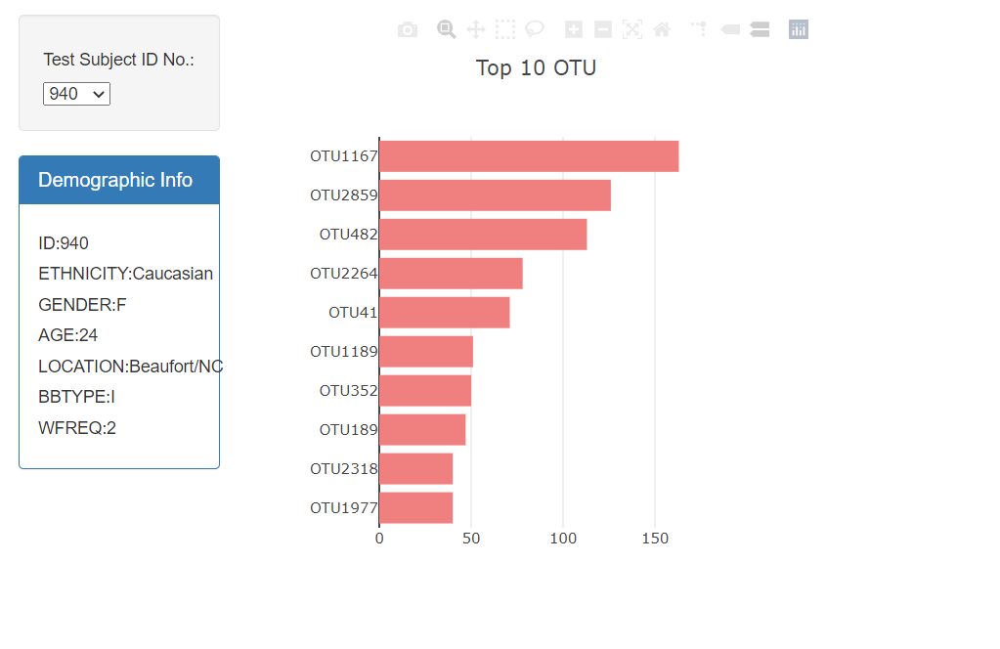
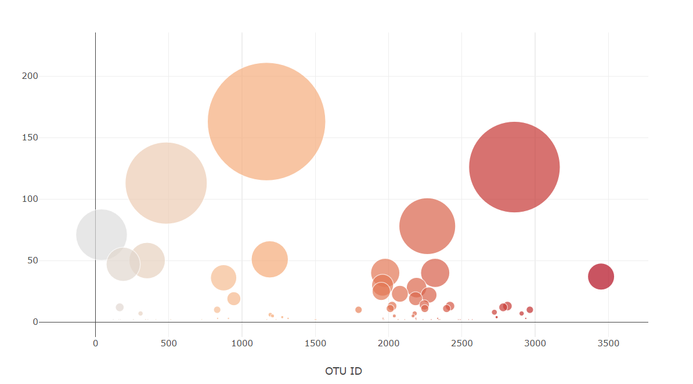

# plotly-challenge

* Creating a Bar chart that uses data from the samples route (/samples/) to display the top 10 samples.

* Creating a Bubble Chart that uses data from the samples route (/samples/) to display each sample.

Copyright &copy; Ravindra Patel 2020

