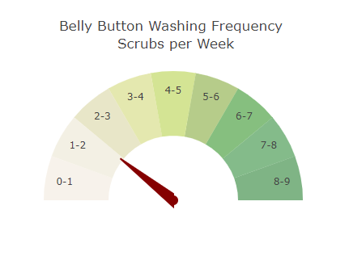

# plotly-challenge

## Belly Button Biodiversity

- The dashboard created conatins the individual's demographic information that is selected from the dropdown.
- As well as Bar chart with a dropdown menu to display the "Top 10 OTUs" found in that individual. 
- Below that you can find a Bubble chart that displays each sample.  

In order to run index.html file click this link: https://raviny90.github.io/plotly-challenge/

* Creating a Bar chart that uses data from the samples route (/samples/) to display the Washing Frequency.

* Creating a Bar chart that uses data from the samples route (/samples/) to display the top 10 samples.

* Creating a Bubble Chart that uses data from the samples route (/samples/) to display each sample.

Copyright &copy; Ravindra Patel 2020

